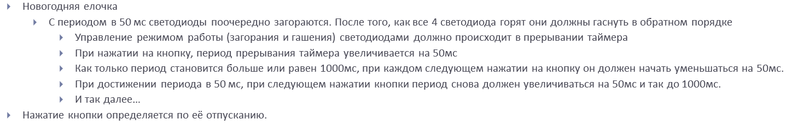
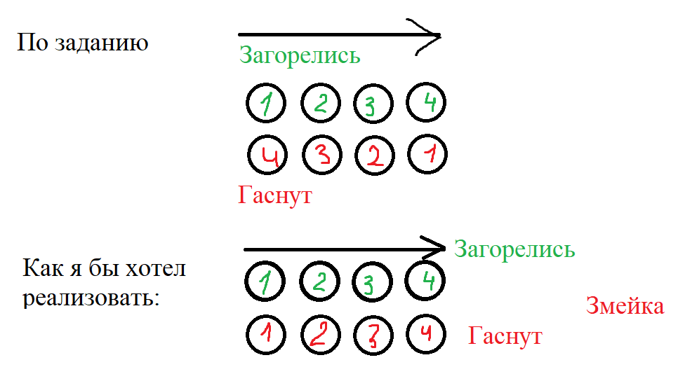

== Работа в IAR Embedded Workbench

Задание:

Было принято решение немного изменить последовательность включения светодиодов, а именно
вместо ёлочной гирлянды представить "змейку"

Весь код программы условно можно разделить на три части:

- Запуск функции ___low_leve_init()_, в которой происходит основная настройка программы. (Запускается единожды).
- Код для прерывания таймера *TIM_5*, который отвечает только за включение светодиодов.
- *main*, в котором описывается работа с кнопкой

Рабочий код представлен ниже:

----
//#include <cstdint>
#include "gpiocregisters.hpp"
#include "gpioaregisters.hpp"
#include "rccregisters.hpp"
#include "tim5registers.hpp"
#include "nvicregisters.hpp"

using namespace std ;

extern "C"
{
  int __low_level_init(void)
  {

    RCC::AHB1ENR::GPIOCEN::Enable::Set();
    RCC::AHB1ENR::GPIOAEN::Enable::Set();
    GPIOC::MODER::MODER8::Output::Set();
    GPIOC::MODER::MODER13::Input::Set();
    GPIOA::MODER::MODER5::Output::Set();
    GPIOC::MODER::MODER9::Output::Set();
    GPIOC::MODER::MODER5::Output::Set();

    RCC::APB1ENR::TIM5EN::Enable::Set();
    GPIOC::MODER::MODER13::Input::Set();
    TIM5::PSC::Write(15999U);
    TIM5::ARR::Write(1000U);
    TIM5::CNT::Write(0U);
    NVIC::ISER1::Write(1U << 18U);
    TIM5::DIER::UIE::Value1::Set();                                                         
    return 1;
  }
}
unsigned int flag = 0;
void LedOn(uint8_t Index)
{

  if (flag == 0)
  {
  switch (Index)
    {
      case 0:
      GPIOC::BSRR::BS5::High::Write();
      break;
      case 1:
      GPIOC::BSRR::BS8::High::Write();
      break;
      case 2:
      GPIOC::BSRR::BS9::High::Write();
      break;
      case 3:
      GPIOA::BSRR::BS5::High::Write();
      break;
    }
  }
  if (flag == 1)
  {
      switch (Index)
    {
      case 0:
      GPIOC::BSRR::BR5::Low::Write();
      break;
      case 1:
      GPIOC::BSRR::BR8::Low::Write();
      break;
      case 2:
      GPIOC::BSRR::BR9::Low::Write();
      break;
      case 3:
      GPIOA::BSRR::BR5::Low::Write();
      break;
    }
  }
}
uint8_t Index = 0U;

void MyTim5InterruptHandler()
{

  if (TIM5::SR::UIF::UpdatePending::IsSet() && (TIM5::DIER::UIE::Value1::IsSet())) //разрешено ли прерывание
  {
    TIM5::SR::UIF::NoUpdate::Set();                                                     //сброс флага
    LedOn(Index);
    Index++;
    if (Index == 4)
    {
      Index = 0;
        if (flag == 0)
        {
            flag = 1;
        }
        else
        {
            flag = 0;
        }
    }
  }
}

int main()
{
  uint16_t Leds = 1000U;
  TIM5::CR1::CEN::Enable::Set();
  for(;;)
  {

    if(GPIOC::IDR::IDR13::Low::IsSet())
    {

      TIM5::ARR::Write(Leds);
      TIM5::CNT::Write(0U);
      Leds = Leds - 50U;
      if (Leds == 50U)
      {
        Leds = 1000U;
      }
  }
}

  return 0 ;
}
----

Результат работы программы:

image::https://github.com/wisp-sys/Laba_Zmeya/blob/main/photos/res.gif[]